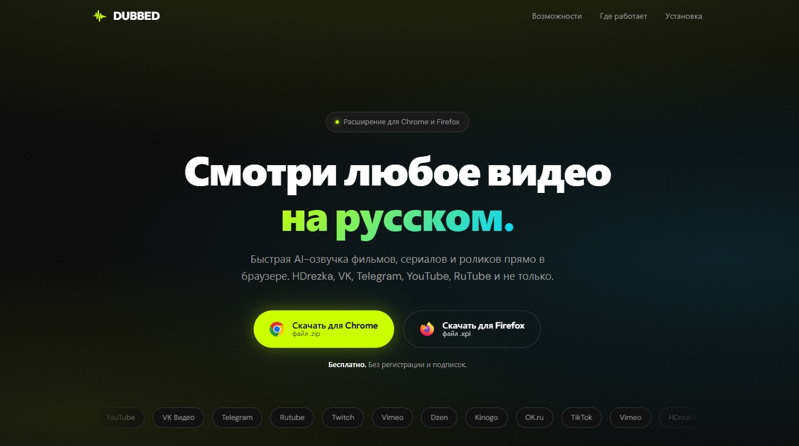

# DUBBED



Бесплатное расширение для Chrome и Firefox: мгновенная AI-озвучка фильмов, сериалов и видео прямо в браузере. Быстрая озвучка на доменах HDrezka; работает в VK, Telegram, YouTube и многих других сайтов.

> **Некоммерческий проект.** Сделан в ознакомительных целях, без коммерческой выгоды: бесплатно, без рекламы, подписок и регистрации. Перевод и озвучка выполняются сервисом Яндекс (TTS API) через публичный клиентский SDK. Все права на обрабатываемые видео и аудио принадлежат их правообладателям.

## Структура

```
index.html          лендинг (статика, без сборки - годится под GitHub Pages)
assets/             логотипы браузеров, иконка расширения, скриншот лендинга
downloads/          готовые сборки для скачивания
extension/          исходники расширения (TypeScript, Vite + CRXJS)
```

## Установка расширения

**Chrome**
1. Скачать `downloads/dubbed-chrome.zip` и распаковать.
2. Открыть `chrome://extensions`, включить «Режим разработчика».
3. «Загрузить распакованное расширение» → выбрать папку.

**Firefox**
1. Скачать `downloads/dubbed-firefox.xpi`.
2. `about:addons` → шестерёнка → «Установить из файла».

## Сборка из исходников

```bash
cd extension
npm install
npm run build:ext   # соберёт сборки для Chrome и Firefox в dist-ext/
```

## Лендинг локально

```bash
python -m http.server 8000
# открыть http://127.0.0.1:8000
```

